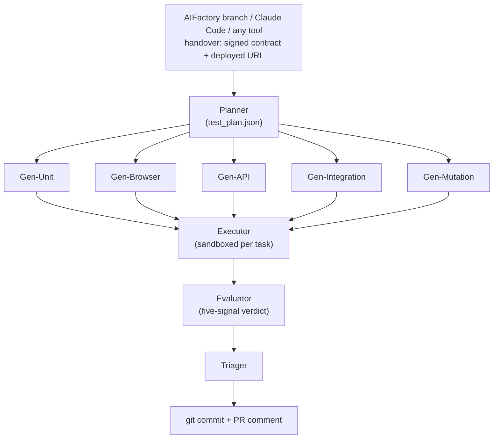

# TFactory

**Autonomous test generation and execution platform.** Started as a sister
project to [AIFactory](https://github.com/olafkfreund/AIFactory) — now a
standalone product you can drive from any tool.

Hand TFactory a finished feature's acceptance criteria — from AIFactory,
Claude Code, or anything else, via the MCP control plane or a plain file
(markdown / Gherkin / EARS, see [`guides/spec-sources.md`](guides/spec-sources.md)).
It generates tests aligned to those criteria across the lane spine
(unit / browser / api / integration / mutation), runs them in an isolated
sandbox, evaluates quality with a five-signal verdict, grades each acceptance
criterion against a test that actually ran, commits the suite to the feature
branch, and posts a triage report to the PR — autonomously.

> **Where we are (June 2026, v0.9.x).** The planner auto-runs on ingest, and the
> AIFactory handoff carries the signed Task Contract plus the deployed URL — so
> TFactory tests the *declared* acceptance criteria against the *real*
> deployment. The browser lane now runs in a reproducible per-task Nix toolchain
> inside an ephemeral Kubernetes Job (RFC-0005 Tier A), captures screenshots and
> video recordings, and surfaces them as visible evidence in the portal and in
> the CFactory cockpit. An acceptance-criteria fidelity ledger reports an honest
> "verified X/Y" per criterion, and authenticated targets — including ones gated
> by TOTP two-factor auth — can be tested against a disposable identity provider
> with zero production credentials.

## Quickstart (NixOS / flake-based)

```bash
# One-command dev environment via the flake:
nix develop

# (inside the shell)
tfactory-minimal-venv   # creates apps/backend/.venv with just pytest+pytest-asyncio
tfactory-test           # runs the non-SDK backend suite

# For the full backend SDK install (graphiti, claude-agent-sdk, etc.):
bootstrap-venv
```

The dev shell brings in Python 3.13, Node 22, uv, git, gh, just, ripgrep, jq and
docker-client, plus four shell functions: `bootstrap-venv`,
`tfactory-minimal-venv`, `tfactory-test`, `verify-fork`.

For auto-loading via `direnv`:

```bash
nix profile install nixpkgs#nix-direnv
direnv allow
```

Non-Nix users can fall back to `npm run install:backend` (per the
[Quickstart](https://tfactory.freundcloud.com/) on the docs site) — the Nix path
just makes setup deterministic.

> **Note for non-Nix npm users:** the nix devShell sets `NODE_ENV=production`,
> which makes `npm install` skip devDependencies (including vitest). If you're
> inside `nix develop` and running `npm install` in `apps/frontend-web/`, first
> `unset NODE_ENV`. Captured in detail in `guides/e2e-smoke.md`.

## Running the portal

```bash
# Backend (FastAPI on :3102)
cd apps/web-server
source .venv/bin/activate    # if you have a per-app venv
python -m server.main

# Frontend (Vite dev server on :3100)
cd apps/frontend-web
npm install                  # unset NODE_ENV first if inside nix develop
npm run dev
```

Then visit **http://localhost:3100** for the TFactory portal.

The portal's task-detail view (`apps/frontend-web/src/components/tfactory/`) has
tabs for **Status / Lanes / Verdicts / Report / Acceptance / Logs / Evidence**:

- **Acceptance** — the acceptance-criteria fidelity ledger ("Verified X/Y"), with
  each criterion linked to the test and screenshots that prove it.
- **Evidence** — the browser lane's captured screenshots and video recordings,
  plus per-test evidence and visual-regression baselines.
- **Lanes** — the Unit / Browser / API / Integration / Mutation lane spine.
- **Logs** — a WebSocket live tail of the run.

## High-level architecture



The middle row is the **five-lane spine** — one generator per modality (unit,
browser, api, integration, mutation). Five pipeline stages (Planner / per-lane
Generators / Executor / Evaluator /
Triager) and five lanes (unit / browser / api / integration / mutation), with a
spec-aware handover from AIFactory. The stages auto-advance via `TFACTORY_AUTO_*`
env vars; each stage writes its outputs to
`~/.tfactory/workspaces/{project}/specs/{spec}/` and forwards via a
fire-and-forget scheduler. See `apps/backend/agents/` for each agent.

### Reproducible execution (RFC-0005 Tier A)

The cluster pods have no container runtime, so the browser lane runs in an
ephemeral Kubernetes Job using a per-task **Nix** toolchain: the planner declares
the environment, a flake materializes the exact tools (including a version-matched
Playwright and its browsers), and the test runs against the real app inside the
Job. Screenshots land in `findings/screenshots/` and Playwright recordings in
`findings/videos/`; both are served by the portal and rendered in the Acceptance
and Evidence tabs.

## Status by lane

The lane spine is modality-based (Decision 2). Security scanning is delegated to
dedicated pipelines and is out of scope here; TFactory focuses on functional and
feature testing.

| Lane | Status | Runtime | Coverage | Evidence |
|---|---|---|---|---|
| **Unit** | Active | `tfactory-runner-pytest` (Python) / `tfactory-runner-jest` (TypeScript) | line (cobertura / lcov) | — |
| **Browser** | Active | Nix toolchain in a k8s Job (Playwright); host fallback where applicable | n/a (line coverage doesn't apply when the test drives the browser) | screenshots, video, trace |
| **API** | Active | per-framework image + HTTP HAR recorder | line where applicable | network.har |
| **Integration** | Active | per-framework image + AppRuntime (multi-service) | line where applicable | network.har, service logs |
| **Mutation** | Active | `mutmut` (Python) / Stryker (TypeScript) — one-mutation-per-run probe in the Evaluator | per-mutant (killed / survived) | — |

The Planner picks each subtask's lane from its `(language, framework)` via the
framework registry (`frameworks/{pytest,jest,playwright}/descriptor.yaml`). New
languages and additional pipelines slot into this same spine through new
`FrameworkDescriptor`s — no lane additions required.

## Acceptance-criteria fidelity

A passing test is not the same as a verified requirement. The Triager builds an
acceptance-criteria ledger that maps each criterion to the tests that exercise it
and grades it `verified` only when at least one of those tests actually passed —
reporting an honest "verified X/Y", never a blanket "done". For interactive UI
criteria, the linked evidence is the screenshot of the rendered page and a
recording of the test driving it.

## Authenticated and MFA-gated targets

Agents often need to reach real services behind a login. TFactory's
`.tfactory.yml` auth schema supports form, API-token, basic-auth and **TOTP
two-factor** credentials, with an ordered login-step flow for SSO. For 2FA we do
not bypass MFA: following RFC-0007's Class C pattern the pipeline can provision a
**disposable identity provider** (an ephemeral Keycloak), seed a user whose OTP
secret it owns, generate valid RFC-6238 codes at run time with a `fill_totp`
login step, capture the authenticated page, and tear the IdP down — with zero
production credentials. See [`guides/credentials.md`](guides/credentials.md) and
the [Credentials](https://tfactory.freundcloud.com/credentials/) page.

## End-to-end smoke

Once you have a real AIFactory project, a Claude API key and Docker:

```bash
scripts/e2e-smoke.sh --list           # list the verification scenarios
scripts/e2e-smoke.sh --dry-run --all  # sanity-check the runner (no env, no LLM)

export ANTHROPIC_API_KEY=sk-ant-...
export TFACTORY_AIFACTORY_ROOT=$HOME/Source/GitHub/MyApp
export TFACTORY_AIFACTORY_BRANCH=feature/...
scripts/e2e-smoke.sh --all
```

Full walkthrough, including the manual scenarios (mutation, hallucination guard,
docker-down), in **`guides/e2e-smoke.md`**.

## Tests

| Suite | What | Time |
|---|---|---|
| Backend non-SDK (`tests/test_*.py`) | Pure-Python primitives + agent loops with a mocked SDK | seconds |
| Frontend (`apps/frontend-web/src/**/*.test.tsx`) | vitest + React Testing Library | seconds |
| End-to-end smoke (`scripts/e2e-smoke.sh`) | Real LLM + Docker + git + gh — operator-driven | manual |

CI runs the first two on every commit; the third is operator-driven.

```bash
# Backend
PYTHONPATH=apps/backend apps/backend/.venv/bin/pytest -q tests/

# Frontend (under nix devShell, unset NODE_ENV first)
cd apps/frontend-web && ../../node_modules/.bin/vitest run

# Fork-hygiene check (every stray AIFactory reference is allowlisted explicitly)
scripts/verify-fork.sh --no-import
```

## Connect to your environment — Credential Broker

Agents often need to reach real services and cloud environments (a staging API, a
Kubernetes cluster, a GCP/AWS/Azure project) to plan and run tests — but secrets
must never land in the repo. The Credential Broker (epic
[#62](https://github.com/olafkfreund/TFactory/issues/62)) resolves credentials
from a pluggable backend and exposes them to the agents ephemerally:

- **Backends:** Azure Key Vault, AWS Secrets Manager, GCP Secret Manager,
  HashiCorp Vault, local sops / age / agenix, or plain env. One ref syntax
  (`vault:path#field`, `gcp-sm://proj/secret`, `sops:file#key`, …); cloud SDKs
  load lazily so an absent package never breaks startup.
- **Ephemeral and redacted:** file credentials (kubeconfig, GCP ADC) are written
  `0600` to a per-task scratch dir and wiped when the task ends; resolved values
  are redacted from logs.
- **Honest egress:** off by default — no cloud credential is resolved unless the
  project opts in (`.tfactory.yml` `egress.enabled`).
  `python -m tfactory_secrets.cli audit` prints a secret-free manifest of exactly
  what would leave your network.

## Run on any LLM

TFactory routes each pipeline phase to a provider purely from the model string —
no separate provider switch. Supported: the Claude Agent SDK (primary), OpenAI
Codex, Gemini CLI, GitHub Copilot CLI, Ollama (local), and any OpenAI-compatible
endpoint (vLLM / LM Studio / OpenRouter / Together / Groq / LocalAI). This lets a
team run on a flat-rate subscription, a self-hosted model, or fully air-gapped —
with an honest data-egress badge (`python apps/backend/byo_llm.py <model>`) so you
always know whether a run keeps data on your network. See
[`guides/byo-llm.md`](guides/byo-llm.md).

## Docs

Full project documentation is published at **https://tfactory.freundcloud.com/**.

Direct links:

- [Architecture](https://tfactory.freundcloud.com/architecture/) — directory structure, workspace layout, dataflow
- [Showcase](https://tfactory.freundcloud.com/showcase/) — the pipeline in action with real evidence
- [Design Plan](https://tfactory.freundcloud.com/design-plan/) — rationale, locked decisions, risk register
- [Technical Spec](https://tfactory.freundcloud.com/technical-spec/) — per-component detail
- [Credentials](https://tfactory.freundcloud.com/credentials/) — the Credential Broker and MFA
- [Progress](https://tfactory.freundcloud.com/progress/) — the per-task build log

In-repo guides (`guides/`):

- **`guides/e2e-smoke.md`** — operator guide for the verification scenarios
- **`guides/HANDOVER_WORKFLOW.md`** — how to trigger TFactory from a live Claude Code session
- **`guides/CLAUDE_CODE_MCP_TOOLS.md`** — driving TFactory tasks from the MCP control plane
- **`guides/byo-llm.md`** — run TFactory fully on your own infrastructure with a verifiable no-egress guarantee
- **`guides/spec-sources.md`** — use TFactory without AIFactory: ingest any acceptance-criteria source (markdown / Gherkin / EARS)

## Project tracking

- **Epic and sub-issues:** https://github.com/olafkfreund/TFactory/issues
- **Discussions / questions:** open an issue with the `question` label

## License

[MIT OR GPL-3.0](LICENSE).
