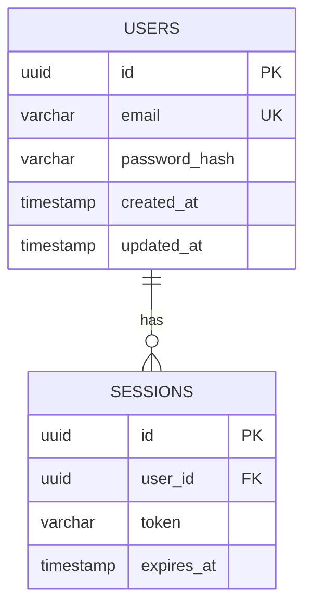
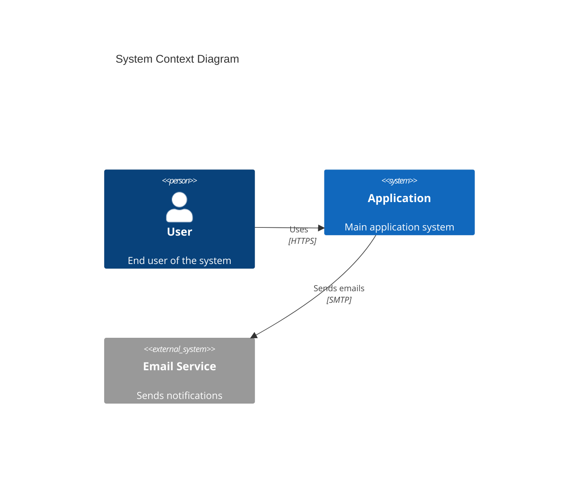
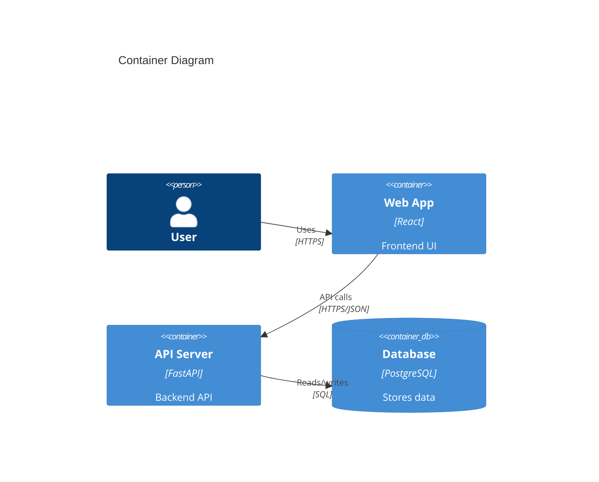
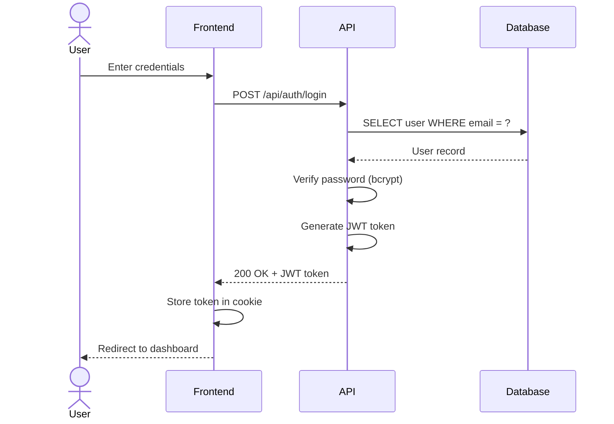

# Architecture Document: [Project Name]

> **Generated**: [Date]
> **Complexity Level**: [Level X - Title]
> **Architect**: Winston (Principal Software Architect)

---

## 1. System Overview

### Purpose

[Brief description of what this system does and why it exists]

### Key Capabilities

- Capability 1
- Capability 2
- Capability 3

### User Journeys

The following user journeys drive the architecture decisions:

1. **Journey 1**: [Description]
2. **Journey 2**: [Description]
3. **Journey 3**: [Description]

### System Boundary

**In Scope:**
- Component A
- Component B

**Out of Scope (External Services):**
- Service X
- Service Y

---

## 2. Database Schema

### Tables

#### Table: `users`

**Purpose**: Store user account information

| Column | Type | Constraints | Description |
|--------|------|-------------|-------------|
| id | UUID | PK, NOT NULL | Unique identifier |
| email | VARCHAR(255) | UNIQUE, NOT NULL | User email address |
| password_hash | VARCHAR(255) | NOT NULL | Hashed password (bcrypt) |
| created_at | TIMESTAMP | NOT NULL, DEFAULT NOW() | Account creation timestamp |
| updated_at | TIMESTAMP | NOT NULL, DEFAULT NOW() | Last update timestamp |

**Indexes**:
- `idx_users_email` on `email` - For login queries
- `idx_users_created_at` on `created_at` - For analytics

**Relationships**:
- `users.id` ← `sessions.user_id` (One-to-Many)

[Add more tables as needed]

### ERD Diagram



---

## 3. API Design

### Authentication

**Method**: JWT (JSON Web Tokens)

- Token expiry: 24 hours
- Refresh token expiry: 30 days
- Token stored in HTTP-only secure cookies

### Base URL

- Development: `http://localhost:8000/api`
- Production: `https://api.example.com`

### Endpoints

#### Authentication

##### `POST /api/auth/register`

**Purpose**: Register a new user account

**Request**:
```json
{
  "email": "user@example.com",
  "password": "SecurePassword123!"
}
```

**Response** (201 Created):
```json
{
  "user": {
    "id": "uuid",
    "email": "user@example.com"
  },
  "token": "jwt.token.here"
}
```

**Error Responses**:
- `400 Bad Request` - Invalid input (weak password, invalid email)
- `409 Conflict` - Email already registered

##### `POST /api/auth/login`

**Purpose**: Authenticate user and return JWT

**Request**:
```json
{
  "email": "user@example.com",
  "password": "SecurePassword123!"
}
```

**Response** (200 OK):
```json
{
  "user": {
    "id": "uuid",
    "email": "user@example.com"
  },
  "token": "jwt.token.here"
}
```

**Error Responses**:
- `400 Bad Request` - Missing required fields
- `401 Unauthorized` - Invalid credentials

[Add more endpoints as needed]

---

## 4. Security Considerations

### Authentication

- **Method**: JWT with bcrypt password hashing (cost factor: 12)
- **Token Storage**: HTTP-only secure cookies (prevents XSS)
- **Token Expiry**: 24 hours (access token), 30 days (refresh token)
- **Password Policy**: Minimum 8 characters, must include uppercase, lowercase, number, special character

### Authorization

- **Model**: Role-Based Access Control (RBAC)
- **Roles**: `user`, `admin`, `moderator`
- **Enforcement**: Middleware checks on every protected route

### Data Protection

- **Encryption at Rest**: Database encryption enabled (AES-256)
- **Encryption in Transit**: TLS 1.3 for all API communication
- **PII Handling**: Email and personal data encrypted in database
- **Password Storage**: Never store plain text, always bcrypt hashed

### OWASP Top 10 Mitigations

1. **Injection Attacks**
   - Use parameterized queries (no raw SQL)
   - Input validation on all API endpoints
   - ORM query builders (SQLAlchemy/Prisma) for safe queries

2. **Broken Authentication**
   - JWT with secure signature (HS256)
   - HTTP-only cookies prevent XSS token theft
   - Rate limiting on login attempts (5 per minute)

3. **Sensitive Data Exposure**
   - TLS 1.3 for all traffic
   - PII encrypted in database
   - No sensitive data in logs

4. **XML External Entities (XXE)**
   - Not applicable (JSON API only)

5. **Broken Access Control**
   - Middleware enforces authorization on every route
   - Deny by default (must explicitly allow access)

6. **Security Misconfiguration**
   - Default credentials changed
   - Unnecessary services disabled
   - Security headers (CSP, X-Frame-Options, etc.)

7. **Cross-Site Scripting (XSS)**
   - Input sanitization on all user input
   - Content Security Policy headers
   - React auto-escapes output

8. **Insecure Deserialization**
   - Only deserialize trusted data
   - JSON schema validation on all inputs

9. **Using Components with Known Vulnerabilities**
   - Dependabot enabled for automated security updates
   - Monthly dependency audits

10. **Insufficient Logging & Monitoring**
    - All auth failures logged
    - API errors logged with correlation IDs
    - Alerting on suspicious patterns (failed login spikes)

---

## 5. Technology Stack

### Backend

- **Language**: Python 3.12+
- **Framework**: FastAPI 0.100+
- **Database**: PostgreSQL 15+
- **ORM**: SQLAlchemy 2.0
- **Authentication**: PyJWT for JWT tokens
- **Password Hashing**: bcrypt
- **Validation**: Pydantic v2

### Frontend

- **Framework**: React 19
- **Language**: TypeScript 5.0+
- **State Management**: React Context API
- **HTTP Client**: Axios
- **Routing**: React Router v6

### Infrastructure

- **Hosting**: Docker containers
- **Database**: PostgreSQL (managed service or self-hosted)
- **CI/CD**: GitHub Actions
- **Monitoring**: Prometheus + Grafana
- **Logging**: Structured JSON logs

---

## 6. Architecture Decision Records (ADRs)

### ADR-001: Use PostgreSQL for Primary Database

**Status**: Accepted

**Context**:
We need a reliable, ACID-compliant database for storing user data, sessions, and application state. Options considered: PostgreSQL, MySQL, MongoDB.

**Decision**:
Use PostgreSQL 15+ as the primary database.

**Rationale**:
- **ACID compliance**: Critical for financial/user data integrity
- **JSON support**: Native JSONB for flexible schemas when needed
- **Proven at scale**: Battle-tested in production for 20+ years
- **Rich ecosystem**: Excellent ORMs (SQLAlchemy), extensions (PostGIS), tooling
- **Open source**: No vendor lock-in, strong community

Alternatives rejected:
- **MySQL**: Less advanced JSON support, weaker text search
- **MongoDB**: NoSQL not needed, ACID compliance issues, schema flexibility causes more problems than it solves

**Consequences**:
- **Positive**: Strong data integrity, excellent query optimizer, rich feature set
- **Negative**: Requires more operational knowledge than managed NoSQL (acceptable trade-off)

---

### ADR-002: Use JWT for Stateless Authentication

**Status**: Accepted

**Context**:
Need authentication that scales horizontally without session storage. Options: JWT, session cookies, OAuth 2.0.

**Decision**:
Use JWT (JSON Web Tokens) with HTTP-only cookies.

**Rationale**:
- **Stateless**: No server-side session storage needed
- **Scalable**: Any server can validate tokens without shared state
- **Standard**: Industry-standard (RFC 7519)
- **Flexible**: Can include custom claims (user role, permissions)

**Consequences**:
- **Positive**: Horizontal scaling trivial, no session DB needed
- **Negative**: Cannot revoke tokens before expiry (mitigate with short expiry + refresh tokens)

---

[Add more ADRs as needed for major decisions]

---

## 7. Diagrams

### C4 Context Diagram



### C4 Container Diagram



### Sequence Diagram: User Login Flow



---

## 8. Scalability & Performance

### Horizontal Scaling

- Stateless API servers (JWT auth enables this)
- Load balancer distributes traffic across API instances
- Database connection pooling (max 20 connections per instance)

### Caching Strategy

- **Redis** for session data and rate limiting
- **CDN** for static assets
- **API response caching** for read-heavy endpoints (5 minute TTL)

### Database Optimization

- Indexes on all foreign keys and frequently queried columns
- Query analysis with EXPLAIN before deploying
- Read replicas for analytics queries (separate from primary)

### Bottlenecks

- Database writes are the primary bottleneck
- Mitigate with: connection pooling, batch inserts, async write queues

---

## 9. Disaster Recovery

### Backup Strategy

- **Database**: Automated daily backups, 30-day retention
- **Point-in-time recovery**: Last 7 days via WAL archives
- **Backup testing**: Monthly restore drills to verify backups work

### Failover Plan

- **Database**: Primary-replica setup, auto-failover on primary failure (60 second RTO)
- **API servers**: Multiple instances behind load balancer, no single point of failure
- **Monitoring**: Alerts on failure, PagerDuty for on-call

### Data Retention

- **User data**: Retained indefinitely unless user requests deletion (GDPR compliance)
- **Logs**: 90 days retention
- **Backups**: 30 days

---

## 10. Observability

### Logging

- **Format**: Structured JSON logs with correlation IDs
- **Levels**: ERROR, WARN, INFO, DEBUG
- **Sensitive data**: Never log passwords, tokens, or PII
- **Correlation**: Request ID tracked across all services

### Monitoring

- **Metrics**: Prometheus for time-series data
- **Dashboards**: Grafana for visualization
- **Key metrics**:
  - API request rate, latency, error rate (RED metrics)
  - Database connection pool usage
  - Authentication success/failure rate

### Alerting

- **Critical**: Database down, API error rate > 5%
- **Warning**: High latency (> 1s p95), connection pool exhaustion
- **Notification**: PagerDuty for critical, Slack for warnings

### Tracing

- **Tool**: OpenTelemetry
- **Scope**: Full request traces across API → Database
- **Sampling**: 10% of requests (100% of errors)

---

## Appendix: Open Questions

[List any architectural decisions that need stakeholder input]

1. Question 1: ...
2. Question 2: ...

---

**Document Status**: DRAFT
**Last Updated**: [Date]
**Next Review**: [Date + 30 days]
