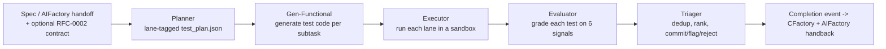

# TFactory — what it is, what it can test, and how to use it

This is an honest capability map. Every item is marked: **[Implemented]**, **[Partial]**,
**[RFC-only]** (designed, not built), or **[Absent]**. Where something is not supported,
this says so plainly rather than implying it.

## 1. What TFactory is

TFactory is the verification stage of the PARR pipeline (Plan, Act, Review, Run). It
takes a spec (or an AIFactory build handoff) and autonomously generates tests, runs them
in an isolated sandbox, grades each test, and emits a ranked triage report plus a
completion event. **[Implemented]**

Pipeline (each stage is an agent in `apps/backend/agents/`):

Key property: side effects (git commit, PR comment) are **dry-run by default**; verdicts
are evidence, not blind commits.

## 2. What you can test

### Lanes [Implemented]
`unit`, `browser`, `api`, `integration`, `mutation` (`tools/runners/lane_dispatch.py`,
`test_plan/enums.py`).

### Frameworks and languages

| Framework | Language | Lanes | Status |
| --- | --- | --- | --- |
| pytest | Python | unit, api | Implemented |
| jest, vitest | TypeScript | unit | Implemented |
| playwright | TypeScript | browser (screenshots, video, trace) | Implemented |
| cypress | TypeScript | browser | Implemented |
| junit | Java | unit, api (JaCoCo + PIT) | Partial (runner + hooks present) |
| cloud-discover, cloud-prowler | cloud | integration | Implemented (CSPM, read-only) |
| Go, Rust | — | — | Absent |
| C#/.NET | — | — | RFC-only |

### Quality signals (the verdict) [Implemented]
Coverage delta, 3x stability, mutation (Python AST / TS Stryker / Java PIT), flake-lint,
LLM semantic relevance, CI-parity, plus cross-run flaky-history. Verdict per test:
accept / flag / reject (`agents/evaluator.py`, `stability_runner.py`, `mutate_probe.py`,
`flaky_history.py`).

### Advanced testing — honest status
- Visual regression (Playwright `toHaveScreenshot`, baselines in the portal): **[Partial]** — Playwright only, manual baseline review; the RFC-0005 Nix Job now produces real screenshots automatically (see the Nix Reproducible Testing guide).
- Cloud posture (Prowler 5.x, AWS/GCP/Azure, 500+ CIS checks): **[Implemented]**
- Contract testing (Pact / consumer-driven): **[Absent]** — an `api` lane against a live URL exists, but no Pact/schema contracts.
- Performance / load (k6, Locust, JMeter, Gatling): **[Absent]** (out of scope by design).
- Chaos / fault injection (chaos-mesh, litmus, toxiproxy, pod-kill, partitions): **[Absent]** (out of scope; no code).
- Accessibility (axe-core, pa11y, Lighthouse): **[Absent]** (deferred).
- Application SAST/DAST of the code under test: **[Absent]** by design — delegated to dedicated security pipelines (DEC-002).

### Verification Assurance Level (the VAL ladder) [Implemented]
A single pass/fail collapses too much. Per RFC-0006 every run reports a
**Verification Assurance Level** — a ladder stating how far the result was
actually verified (suite executed → API/integration hit → browser-verified),
where a level is only claimable when the evidence for it exists. The Report tab
leads with it (e.g. `Verified to VAL-0. NOT verified: VAL-1 failed; VAL-2
not_run`), and a lane that did not run is `not_run`, never a silent pass. The VAL
gate keeps the verdict honest; the RFC-0015 traceability matrix maps each
requirement to the test and the VAL it earned. See the
[Portal Gallery]({{ '/gallery/' | relative_url }}) for the Report and Acceptance
tabs on a real run.

**VAL-3 disposable target (k8s-Job backend) [Implemented, default OFF].** VAL-3
verifies *effectful* behaviour against a real, disposable host — never
production. The k8s-Job backend runs each effectful VAL-3 command as an
ephemeral Kubernetes Job (create → watch → logs → delete), and is env-gated:

- `TFACTORY_VAL3_K8S_JOB=1` — enable the `k8s-job` backend (lazy-registered at
  provisioning time; with the flag unset nothing changes and VAL-3 stays an
  honest `not_run`).
- `TFACTORY_VAL3_K8S_JOB_IMAGE` — the runner image the Job uses (e.g. the
  tfactory-runner-nix image); required at provision time.

What a VAL-3 run produces: the plan's effectful commands execute inside the
Job, their logs become the run's evidence, the `val_block` records VAL-3 as
achieved (or failed) on that evidence, and the Job is torn down on every path
— including failure. No credentials are placed in the Job env or argv, and
`automountServiceAccountToken` is false. Proven live (Factory#257) with a real
cross-node Job on the factory cluster, full teardown included.

### Verify execution model [Partial — in-pod default; Job-native in progress]
Two execution paths exist for the verify pipeline:
- **In-pod (default, live):** the Evaluator runs each lane inside the
  long-lived service pod. Where there is no container runtime (e.g. a k3d pod),
  a **host-venv pytest fallback** stages the system-under-test into a scratch
  worktree and runs pytest in a host virtualenv, collecting JUnit XML + coverage
  — so the verdict comes from a real execution, not a skipped run. **[Implemented]**
- **Job-native (RFC-0016/0017, in progress):** run the whole verify pipeline as
  a per-task Kubernetes Job in a contract-declared Nix toolchain that matches the
  build env with no drift. The mechanism and its blocking fixes are merged (the
  Job runs on the TFactory image, #479; LLM credentials injected into the Job
  env, #480), but **the production default is still the in-pod path** — the
  default flip (#466/#469) is gated behind `TFACTORY_NIX_RUNNER_IMAGE`, falls
  back to in-pod when absent, and was **reverted pending re-validation**. It is
  not live yet.

## 3. Authentication and MFA

### Target auth in `.tfactory.yml` [Implemented]
Per-target `auth`: `bearer`, `basic`, `oauth2_client_credentials`, `serviceaccount`
(k8s SA token), `mtls`, `none`, and `ref` (points at a stored credential)
(`apps/backend/tfactory_yml/schema.py`). Multi-step / SSO login via ordered `LoginStep`
actions (`goto`/`click`/`fill_username`/`fill_secret`/`wait_for_url`). Playwright
`storageState` login-once is wired (log in once, reuse the session).

### Credential vault [Implemented]
`POST/GET/DELETE /api/test-credentials` stores `form` / `api_token` / `basic_auth` /
`totp` kinds, **encrypted at rest**, secret never returned after creation. Resolved at
run time via the broker (`env:NAME` | `vault:path#field` | `store:<id>` | cloud schemes)
and injected as env vars; all secret values are redacted from logs/artifacts.

### 2FA / MFA — the 4-class model (RFC-0007)
You do not defeat MFA. Each access is classified and routed:
- **A machine-native** (OIDC federation, service accounts, scoped tokens — no MFA in path): **[Implemented]** (native to the sandbox credential path).
- **B bootstrap-once** (device-code / refresh token / **TOTP seed stored as a secret**, codes generated in-process; captured `storageState`): **[Implemented]** — the `totp` kind is stored encrypted, storageState login-once works, and runtime RFC-6238 TOTP-code generation is wired into the auth flow via `fill_totp`.
- **C ephemeral target** (testcontainers / ephemeral Keycloak / disposable cloud project — no prod credential): **[Implemented for Keycloak]** — `agents/ephemeral_keycloak.py` provisions a disposable Keycloak with a preset OTP user and auto-teardown (proven: a real-IdP MFA login via the production `fill_totp` flow); testcontainers cover ephemeral deps. In-cluster Keycloak (k8s Job) + disposable cloud projects remain planned.
- **D un-automatable** (push approval, hardware key, SMS-to-a-person): **[Implemented as an honest refusal]** — `access_scope.py` maps these to "blocked" with a reason; the VAL gate keeps the result honest (never faked).

## 4. Testing services, including already-deployed Dev/UAT

TFactory can test a service it did not build, including a live Dev/UAT deployment. **[Implemented]**

- Point it at a target via `.tfactory.yml` `targets:` (`base_url`) or the
  `TFACTORY_TARGET_URL` override; the Executor health-gates the target before running.
- Target types: `http` (any reachable URL), Kubernetes (`kubectl port-forward` to a
  service via `KubernetesRuntime`), and docker-compose (`AppRuntime` brings the app + deps
  up, health-polls, tears down).
- Authenticate with a vault credential referenced by the target's `auth: {type: ref}`.
- Enable `egress: {enabled: true}` so the credential broker runs (default-deny otherwise).

To test an existing Dev/UAT endpoint by itself: declare the target + `base_url` (or set
`TFACTORY_TARGET_URL`), store its credentials, reference them, enable egress, and ingest a
spec describing what to verify. TFactory generates and runs the tests against that live
endpoint.

Deploying into a sandbox to test: local ephemeral dependencies via **testcontainers**
(Postgres/Redis/Kafka/MinIO) and docker-compose are **[Implemented]** for the integration
lane; provisioning a disposable cloud environment (Class C) is **[RFC-only]**.

## 5. Air-gapped systems

**[Partial].** The egress control is sound — default-deny, opt-in per `.tfactory.yml`, a
secret-free egress manifest (`tfactory_secrets.cli audit`), unit lane runs
`--network=none`, broker backends can be fully local (Vault / sops / age), and secrets are
redacted. But TFactory as shipped expects public internet at build/setup time: the Nix
flake input, PyPI (uv), npm, and Docker images all default to public sources. Running fully
air-gapped is achievable but requires ops setup: a private Nix binary cache + pinned flake
inputs, a private PyPI/npm mirror, and a local container registry with the runner images
pre-loaded. It does not ship pre-configured for that.

## 6. Creating a test plan from GitHub / GitLab issues

Honest status: ingestion is **text/spec-based**, not label-driven auto-discovery.

- **What works [Implemented]:** ingest a spec (acceptance criteria) as text via the API/MCP/CLI;
  PFactory has a `github_issue` / `github_discussion` body channel that accepts an issue
  body you pass in. Accepted formats: **Markdown** (bullets under an "Acceptance Criteria"
  heading, or `AC#N:` markers), **Gherkin** `.feature` (one scenario per criterion), and
  **EARS** ("shall" requirements). Format is auto-detected.
- **What is NOT there:**
  - A poller that watches GitHub issues by label and auto-ingests them: **[Absent]** — you pass the issue body in; nothing scrapes issues by label.
  - GitLab issue ingest: **[Absent]** (only a GitHub body channel exists).
  - A required-label schema to "pick up" an issue: **[Absent]** — ingest is label-agnostic; it reads the text content.

So the labels in `docs/tag-taxonomy.md` (`pfactory`, `handoff:tfactory`, `type:testing`,
`priority:*`, `area:*`) are written **by** PFactory when it emits approved plans
downstream; they are not an input filter that drives ingestion. To drive a plan from an
issue today: take the issue body (with an Acceptance Criteria section) and hand it to the
ingest API/MCP — the labels are for routing the result, not for selection.

## 7. Handing a test plan over for execution (Claude, VSCode, other tools)

Two equivalent front doors, both **[Implemented]**:

1. HTTP: `POST /api/specs/ingest` (TFactory web-server) with:
   `project_id`, `spec_id`, `spec_text`, optional `format`, `target_paths` (target-mode:
   name the modules under test), `source_branch` (build branch to check out), `contract`
   (a full RFC-0002 Task Contract — its `tfactory` and `environment` blocks are
   authoritative), and `git_url` (self-materializing: clone + register an unknown project).
   The auto-pipeline (plan, generate, evaluate, triage) runs on ingest.
2. MCP: TFactory's MCP server exposes `task_create_from_spec` (the no-AIFactory front
   door), `task_create_and_run`, `task_status`, `task_rerun`, `report_get`,
   `project_create/list`. PFactory's MCP server exposes `plan_ingest`/`plan_process`/
   `plan_approve` for the planning side. This is how Claude, an IDE, or another agent hands
   work over — call the MCP tool or POST the spec.

The AIFactory build handoff uses the same `POST /api/specs/ingest` with `git_url` +
`source_branch` + the signed contract.

## 8. Skills, and adding more

TFactory has testing "skills" in two senses:
- Playbook skills under `skills/testing/` (e.g. `integration-testing-testcontainers.md`) —
  reusable testing know-how the agents draw on.
- Framework skills in the registry: each `frameworks/<name>/descriptor.yaml` declares the
  language, lanes, runner image, manifest signals, test-path conventions, coverage
  strategy, an LLM context block, and per-language evaluator hooks.

To add a new testing framework/skill **[Implemented extension path]**:
1. Write `frameworks/<name>/descriptor.yaml` (copy an existing one; the registry validates
   it at startup — `framework_registry/validator.py`).
2. Build `docker/tfactory-runner-<name>/Dockerfile` with the framework + a coverage
   emitter; the image name must match the descriptor's `runtime.image`. (For the Nix path,
   the toolchain can instead come from the per-task flake — see the Nix guide.)
3. If the language is new, add `apps/backend/agents/lang_<language>/` with `preflight.py`,
   `flake_lint.py`, `mutate_probe.py` and wire them into the descriptor's
   `evaluator_hooks`.
4. Optionally add `frameworks/<name>/templates/*.tmpl` for generation.

The Planner detects the framework via `manifest_signals`, Gen-Functional injects the
`context_block`, the Executor runs the image, and the Evaluator dispatches the
language-specific hooks.

## 9. Operator notes: multi-tenant mode and the schema drift gate

### Multi-tenant mode [Implemented, default OFF]

Verification specs, runs, and verdicts can be tenant-scoped (#683):

- `TFACTORY_MULTI_TENANT` — truthy (`1`/`true`/`yes`/`on`) enables tenant
  resolution from the `X-Tenant-Id` header (stamped by the ingress /
  oauth2-proxy). Off (the default) everything resolves to `"default"` and
  behaviour is unchanged apart from the new field.
- Ingest (`POST /api/specs/ingest`) accepts an optional `tenant` field; an
  explicit payload tenant (AIFactory stamps it on handoff) always wins over the
  header — it is deliberate data, not an ambient value.

The tenant is written into the spec workspace (`context/source.json` +
`status.json`) and `GET /api/tfactory/tasks` filters by it when the flag is on.
Legacy rows without a tenant are lazily backfilled to `"default"`.

### Task-contract schema drift gate

The vendored `apps/backend/contracts/task-contract-v2.schema.json` must stay in
sync with the canonical Factory hub schema (`apis/task-contract.schema.json` on
the hub's main). A blocking CI step (`scripts/check_schema_drift.py`) enforces
this: it hard-fails when the canonical schema is not a subset of the vendored
copy (descriptions ignored) and soft-skips only on network failure.

If the gate fails: do **not** hand-edit the vendored file to appease it — sync
it from the hub. Copy the current canonical `apis/task-contract.schema.json`
from the Factory hub over the vendored copy, commit, and the gate goes green.
A drift failure means the hub contract moved and TFactory was validating
against a stale copy.

## 10. Summary — what to trust today

- Solid and live: spec/handoff ingest, plan + generate + run + grade + triage, unit/api/
  browser lanes for Python/TypeScript (Java partial), the 6-signal verdict, testing live
  Dev/UAT targets with vault-backed auth, k8s/compose targets, cloud CSPM, the RFC-0005 Nix
  per-task toolchain with real browser screenshots, and MCP/HTTP handover.
- Partial / opt-in: ephemeral cloud targets, air-gapped operation,
  Java lane depth, visual-regression baseline review.
- Absent (be clear with stakeholders): chaos testing, performance/load, contract (Pact),
  accessibility, app SAST/DAST (delegated by design), GitLab issue ingest, and label-driven
  issue auto-discovery.

See also: "Nix Reproducible Testing" (the per-task toolchain + screenshots) and the fleet
"Reproducible test environments" + PFactory "Planning and Trust" guides.
