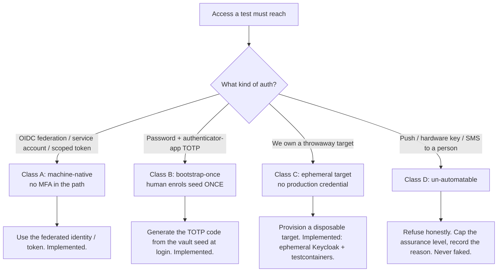

# Testing behind MFA — how the Factory solves it

Automated testing usually dies at the login screen: the moment a target is behind
multi-factor authentication, a script cannot proceed. The Factory's answer is not a
clever bypass — bypassing MFA would be a security hole, and any "test" that disables auth
proves nothing about the real system. Instead we **classify every access and route it**,
and for the common case (an authenticator-app TOTP) we **generate the code the same way
your phone does**, from a seed a human enrolled once.

This page explains the model, shows the mechanism, and walks through four real scenarios.
Capability status is marked honestly throughout.

## The core idea: classify, then route (RFC-0007)

You do not "defeat" MFA. Each thing a test must reach is sorted into one of four classes,
and each class has a defined, honest path:



| Class | Mechanism | MFA in path? | Status |
| --- | --- | --- | --- |
| A machine-native | OIDC federation, service accounts, scoped tokens | No | Implemented |
| B bootstrap-once | password + **TOTP seed stored once**, codes generated in-process; captured `storageState` | Cleared once at enrolment | Implemented |
| C ephemeral target | LocalStack / testcontainers / disposable IdP — no prod credential | None | Implemented (ephemeral Keycloak + testcontainers; in-cluster IdP next) |
| D un-automatable | push approval, hardware key (WebAuthn), SMS-to-a-person | Hard block | Refused honestly (never faked) |

The principle that makes this trustworthy: **we never claim a test ran when the access
was not legitimately available.** Class D is refused with a recorded reason and the
assurance level is capped (RFC-0006), rather than faking a pass.

## How Class B actually works (the mechanism, not a promise)

An authenticator-app code (Google Authenticator, Authy, 1Password, etc.) is a TOTP:
a 6-digit number derived from a shared secret (the "seed") and the current time, per
RFC-6238. The seed is what the QR code encodes at enrolment. If you hold the seed, you can
compute the exact code the user's app would show — that is generation, not interception.

```mermaid
sequenceDiagram
    actor Human as Human (once)
    participant Vault as Encrypted credential vault
    participant TF as TFactory login (Playwright)
    participant App as Target app

    Human->>Vault: Enrol the test account; store the TOTP SEED (kind=totp), encrypted
    Note over Human,Vault: One time only. The human never gives a code again.
    loop every test run
        TF->>Vault: resolve password + TOTP seed (egress-gated, redacted)
        TF->>App: fill username, fill password
        TF->>TF: generate RFC-6238 code from the seed AT FILL TIME
        TF->>App: fill the 6-digit code, submit
        App-->>TF: authenticated; save storageState (login once, reuse across tests)
    end
```

Why "at fill time": a TOTP code lives ~30 seconds. The code is generated inside the
browser login step the instant before it is typed (`__tfTotp(seed)` in the generated
`auth.setup.ts`), so it never expires in flight. The same computation exists server-side
(`agents/totp.py`) and the two are cross-checked to produce identical codes — so what the
browser types is provably the right code. We store the seed, never a static code.

## Scenario 1 — Internal microservice behind OIDC (Class A) [Implemented]

You want to test a service in Dev that trusts your platform's identity (OIDC federation or
a Kubernetes service account). There is no MFA on a machine identity.

`.tfactory.yml`:

```yaml
version: 1
default_target: dev-api
targets:
  - name: dev-api
    type: kubernetes
    context: dev
    namespace: payments
    service: payments-api
    port: 8080
    auth:
      type: serviceaccount   # the pod's mounted SA token
egress:
  enabled: true
```

TFactory port-forwards to the service, presents the service-account token, and runs the
api/browser lanes. No human, no MFA, nothing to bootstrap.

## Scenario 2 — SaaS-style app with password + authenticator 2FA (Class B) [Implemented]

This is the headline. The login page asks for username, password, and a 6-digit
authenticator code. A human enrols a dedicated **test** account once and stores its seed.

Store the secrets (encrypted vault, via `POST /api/test-credentials`, or any broker ref):
the password and the base32 TOTP seed printed by the authenticator enrolment screen.

`.tfactory.yml`:

```yaml
version: 1
default_target: app
targets:
  - name: app
    type: http
    base_url: https://uat.acme-app.com
    auth:
      type: ref
      ref: acme-login
      steps:
        - { action: goto, url: "https://uat.acme-app.com/login" }
        - { action: fill_username, selector: "#email" }
        - { action: fill_secret,   selector: "#password" }
        - { action: click,         selector: "button[type=submit]" }
        - { action: fill_totp,     selector: "#otp" }     # generated at fill time
        - { action: click,         selector: "#verify" }
        - { action: wait_for_url,  url: "dashboard" }
test_credentials:
  acme-login:
    kind: totp
    ref: store:tc_app_password          # the test account password
    as_secret: TF_APP_PASSWORD
    username_ref: store:tc_app_username
    as_username: TF_APP_USERNAME
    totp_ref: store:tc_app_totp_seed    # the authenticator SEED (not a code)
    as_totp_secret: TF_APP_TOTP_SEED
egress:
  enabled: true
```

What happens each run: TFactory resolves the password + seed (egress-gated, redacted from
all logs), runs the login once, the `fill_totp` step generates the live code from the seed,
saves the authenticated session (`storageState`), and every generated browser/api test
reuses that session. The 2FA login is fully automated, with no human in the loop after the
one-time enrolment, and no static code ever stored.

Validated end-to-end (2026-06-17): a real password + TOTP login flow, where the browser
generated the code with the production `fill_totp` path and an **independent** server
verifier (passlib RFC-6238, a different implementation from the browser's node:crypto
generator) accepted it. The setup logged in and saved the session; a follow-up test reused
that session to reach the authenticated page. Two checks passed — login, then session
reuse. Enterprise variants (SHA-256/512, 8-digit, non-30s) are configurable per credential
(`totp_digits`/`totp_algorithm`/`totp_period`) and cross-verified between the browser and
server generators. A malformed seed is rejected at enrolment by the credential API, not as
a failed login later.

## Scenario 3 — Test MFA against a throwaway real IdP (Class C) [Implemented]

When you do not want to touch a real, MFA-protected system at all, the pipeline stands up
a **disposable Keycloak** it owns, seeds a test user whose TOTP secret it chooses, runs the
MFA login against that real IdP, and tears it down — no production credential anywhere.

`agents/ephemeral_keycloak.py` (`EphemeralKeycloak`) generates a realm with a preset OTP
credential (the secret is random per run; the matching base32 seed is handed to the login),
boots Keycloak with `--import-realm`, yields `{base_url, username, password, totp_seed}`, and
**always tears the container down** on exit (cost guard). Proven end to end (2026-06-17): a
provisioner-spun Keycloak accepted the production `fill_totp` login — Keycloak's own Java
TOTP verifier agreed with our generator — then the instance was removed.

This is the cleanest way to exercise a full MFA login with zero production access. (The
container backend is for local/CI; the in-cluster backend — Keycloak as an ephemeral k8s
Job/Service via the sandbox — is the next increment. Disposable cloud projects remain
planned.) Ephemeral dependencies (Postgres/Redis/Kafka/MinIO via testcontainers) also
exist for the integration lane.

## Scenario 4 — Push approval or hardware key (Class D) [Refused honestly]

Some logins require a human to approve a phone push, tap a FIDO2/WebAuthn hardware key, or
read an SMS. These cannot be automated without defeating the security control, and the
Factory will not pretend otherwise.

What happens: the access is classified D, the run records a clear reason
("interactive MFA: hardware key / push approval — not automatable"), and the assurance
level is capped (RFC-0006) rather than reporting a green pass. The honest options are to
provide a Class A machine identity for the test path, or to use a Class C ephemeral target
that does not gate on D. We would rather tell you a gate is un-automatable than fake it.

## What to take away

- The 2FA case people actually hit — authenticator-app TOTP — is solved end to end:
  enrol once, generate codes in-process, reuse the session. [Implemented]
- Machine identities (Class A), disposable targets (Class C, via an ephemeral Keycloak the
  pipeline owns and tears down), and the refusal path (Class D) are all implemented.
- Nothing here bypasses or weakens MFA. We generate codes from a seed a human deliberately
  enrolled, store only the seed (encrypted, redacted), and refuse what genuinely cannot be
  automated.

See also: "Capabilities and Usage" (the full capability map) and the fleet RFC-0007
(access and credential provisioning).
