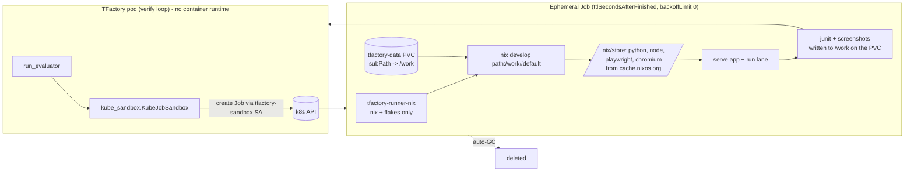
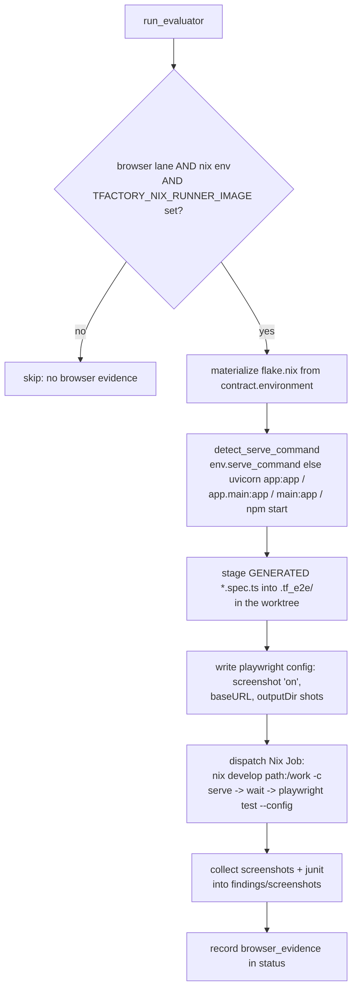

# Nix reproducible testing — how TFactory verifies in a per-task flake

This is the verifier's view of RFC-0005 Tier A. It explains how TFactory takes the
toolchain a plan declared, materializes it as a Nix flake, and runs each test lane —
including a real browser lane that produces screenshots — inside an ephemeral
Kubernetes Job. For the fleet-wide picture see the hub guide "Reproducible test
environments"; for how the plan is built and trusted see PFactory's "Planning and Trust".

## 1. What TFactory does

When a contract carries an `environment` block with `provisioning.method == nix`,
TFactory:

1. Generates a `flake.nix` from the manifest (`agents/nix_env.py: materialize_flake`,
   using the vendored `tools/runners/nix_provisioner.py`). The flake is a pure function
   of the contract, so it matches the env AIFactory built in.
2. Runs the lane inside an ephemeral Kubernetes Job, because TFactory pods have no
   container runtime (k3d) and cannot `docker run`. The Job uses the thin
   `ghcr.io/<owner>/tfactory-runner-nix` image (Nix + flakes only) and co-mounts the
   project worktree from the `tfactory-data` PVC at `/work`.
3. For a browser lane, serves the app and runs the generated Playwright specs, capturing
   screenshots into `findings/screenshots/` and video recordings into `findings/videos/`.

## 2. How the Job runs the flake (pods and sandboxing)

The flake is the sandbox boundary: `nix develop` realises only the pinned dependency
closure into `/nix/store` and puts just those tools on `PATH`. The image carries nothing
but Nix. For a browser lane the flake supplies version-matched `playwright-test` +
`playwright-driver.browsers` plus a fontconfig file so headless Chromium renders text.

Why `path:/work` and not a bare `/work`: the worktree is a co-mounted git repo. A bare
flake reference makes Nix use its git fetcher, which rejects the repo on a uid mismatch
(the Job runs as root; PVC files are uid 65532) and ignores the untracked, generated
`flake.nix`. `path:` copies the directory directly. This was learned against the live
cluster.

## 3. The browser-evidence path (decision logic)

`agents/nix_env.run_browser_evidence` is wired into `agents/evaluator.py` (`run_evaluator`,
step 2c) as an additive, best-effort step, run off the event loop via
`asyncio.to_thread`. It never blocks the verdict pipeline and is a no-op unless there is a
browser lane, a nix env, and the Nix-lane sandbox is configured.

Two design choices, both the result of a live end-to-end run that found real bugs
(fixed in TFactory #392):

- Screenshots come from the runner, not the test. The Playwright config sets
  `screenshot: 'on'`, so every browser test yields a screenshot even though the generated
  specs do not call `page.screenshot()`.
- The generated specs are staged into a clean `.tf_e2e/` and the run is scoped to them.
  The first live run instead picked up a stale `tests/e2e/frontend-board.spec.ts` left in
  the project (pointing at the wrong port) and failed with a connection error — because
  the generated specs live in the spec workspace, not the project worktree. Staging fixes
  that.

## 4. What makes it work in-cluster

- Image: `docker/tfactory-runner-nix/` built and pushed by
  `.github/workflows/nix-runner-image.yml` to `ghcr.io/<owner>/tfactory-runner-nix`.
- RBAC: a `tfactory-sandbox` ServiceAccount + a least-privilege Role (jobs
  create/get/list/watch/delete + pod logs, in-namespace only) bound to the deployment.
  In gitops this lives in `apps/tfactory/manifests`; the Helm chart equivalent is
  `charts/tfactory` (`rbac.jobSandbox`). The pod mounts the SA token only when the
  sandbox is enabled.
- Deployment env: `TFACTORY_NIX_RUNNER_IMAGE` (the Nix image) and
  `TFACTORY_WORKSPACES_PVC` (`tfactory-data`, co-mounted into each Job via subPath).
- Job backend: `tools/runners/kube_sandbox.py` (ported from AIFactory's proven
  `core/kube_sandbox.py`) — pure manifest builder plus a create/watch/logs/delete
  lifecycle via `kubernetes_asyncio`.
- Hardening (#651): every Job pod pins `seccompProfile: RuntimeDefault` and its
  containers run with `allowPrivilegeEscalation: false` and `capabilities: drop ALL`
  plus add-backs (`CHOWN`, `DAC_OVERRIDE`, `FOWNER`) that the root nix user needs to
  write the uid-65532 co-mounted worktree and seed the warm store. `runAsNonRoot` is
  deliberately absent: the nix-runner image runs builds as root by design (see the
  uid-mismatch note in section 2); moving to a nonroot nix image is the upgrade path.
  The Helm chart additionally ships a `NetworkPolicy` for the Job pods
  (`networkPolicy.jobPods`): default-deny ingress, egress limited to DNS, public
  443 (substituters/git/LLM APIs), the kube API server, and same-namespace services.

### Warm `/nix` store trust assumption (shared-cache poisoning)

When `TFACTORY_NIX_STORE_PVC` is set, all per-task Jobs mount ONE warm `/nix`
PVC read-write and share it across tasks. A malicious SUT or test run can
therefore tamper with store paths that later Jobs consume (cross-task cache
poisoning); the deploy lane is the highest-value target because `tofu init`
executes provider binaries selected by the untrusted IaC input. This is an
accepted, documented trade-off today: task isolation on this substrate is
namespaces + policy + dropped capabilities, not a per-task store. Mitigations,
in preference order, when this assumption stops being acceptable:

1. Mount the warm store read-only into task Jobs with a local scratch overlay
   store for new builds.
2. Periodic `nix store verify --all` against the upstream substituters.
3. Per-task (unshared) stores — reverts to cold-fetch cost.

## 5. What teams and operators do

- Teams: write specs with clear UI acceptance criteria (page title, headings, button
  actions). The planner routes them to the browser lane and the manifest carries a browser
  toolchain. Optionally set `environment.serve_command` in the contract when the app start
  is non-standard; otherwise TFactory detects it.
- Operators: the verify-side Nix lane is enabled in TFactory's gitops (the SA/RBAC and the
  two env vars). Nothing else is required per task. You do not hand-write `flake.nix`, add
  screenshot calls, install browsers, or maintain per-language runner images.

## 6. Where each piece lives

| Concern | Module / artifact |
| --- | --- |
| Flake generator (vendored) | `apps/backend/tools/runners/nix_provisioner.py` |
| Materialize + browser evidence | `apps/backend/agents/nix_env.py` |
| Evaluator hook | `apps/backend/agents/evaluator.py` (`run_evaluator`, step 2c) |
| Ephemeral Job backend | `apps/backend/tools/runners/kube_sandbox.py` |
| Nix runner image | `docker/tfactory-runner-nix/` + `.github/workflows/nix-runner-image.yml` |
| RBAC + env (chart) | `charts/tfactory` (`rbac.jobSandbox`) |
| RBAC + env (live) | factory-gitops `apps/tfactory/manifests` |

See also: the hub guide "Reproducible test environments" and PFactory's "Planning and
Trust".
