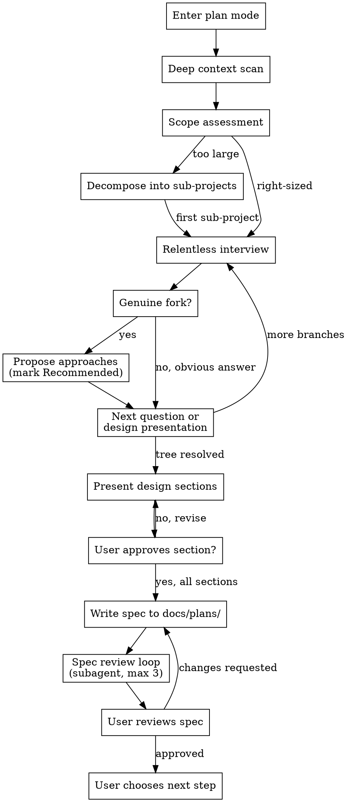

# super-brainstorm

> Source: https://github.com/maddhruv | v0.1.0 | License: MIT | Tags: brainstorming, design, planning, architecture, spec-writing, interviewing

---

# Super Brainstorm

You MUST use this before any creative work - creating features, building components, adding functionality, modifying behavior, designing systems, or making architectural decisions. Enters plan mode, reads all available docs, explores the codebase deeply, then interviews the user relentlessly with ultrathink-level reasoning on every decision until a shared understanding is reached. Produces a validated design spec before any implementation begins. Triggers on feature requests, design discussions, refactors, new projects, component creation, system changes, and any task requiring design decisions.

---

When this skill is activated, always start your first response with the brain emoji.

# Super Brainstorm

## Activation Banner

**At the very start of every super-brainstorm invocation**, before any other output, display this ASCII art banner:

```
███████╗██╗   ██╗██████╗ ███████╗██████╗
██╔════╝██║   ██║██╔══██╗██╔════╝██╔══██╗
███████╗██║   ██║██████╔╝█████╗  ██████╔╝
╚════██║██║   ██║██╔═══╝ ██╔══╝  ██╔══██╗
███████║╚██████╔╝██║     ███████╗██║  ██║
╚══════╝ ╚═════╝ ╚═╝     ╚══════╝╚═╝  ╚═╝
██████╗ ██████╗  █████╗ ██╗███╗   ██╗███████╗████████╗ ██████╗ ██████╗ ███╗   ███╗
██╔══██╗██╔══██╗██╔══██╗██║████╗  ██║██╔════╝╚══██╔══╝██╔═══██╗██╔══██╗████╗ ████║
██████╔╝██████╔╝███████║██║██╔██╗ ██║███████╗   ██║   ██║   ██║██████╔╝██╔████╔██║
██╔══██╗██╔══██╗██╔══██║██║██║╚██╗██║╚════██║   ██║   ██║   ██║██╔══██╗██║╚██╔╝██║
██████╔╝██║  ██║██║  ██║██║██║ ╚████║███████║   ██║   ╚██████╔╝██║  ██║██║ ╚═╝ ██║
╚═════╝ ╚═╝  ╚═╝╚═╝  ╚═╝╚═╝╚═╝  ╚═══╝╚══════╝   ╚═╝    ╚═════╝ ╚═╝  ╚═╝╚═╝     ╚═╝
```

Follow the banner immediately with: `Entering plan mode - ultrathink enabled`

---

A relentless, ultrathink-powered design interview that turns vague ideas into
bulletproof specs. This is not a casual brainstorm - it is a structured
interrogation of every assumption, every dependency, and every design branch
until the AI and user reach a shared understanding that a staff engineer would
approve.

---

## Hard Gates

<HARD-GATE>
1. ALWAYS enter plan mode at the start of this skill. Do not proceed in normal mode.
2. ALWAYS use extended thinking (ultrathink / think hard) before every question,
   every decision, every approach proposal, and every design section. No exceptions.
3. Do NOT invoke any implementation skill, write any code, scaffold any project,
   or take any implementation action until the spec is written and the user has
   approved it. This applies to EVERY project regardless of perceived simplicity.
</HARD-GATE>

## Anti-Pattern: "This Is Too Simple To Need A Design"

Every project goes through this process. A todo list, a single-function utility,
a config change - all of them. "Simple" projects are where unexamined assumptions
cause the most wasted work. The design can be short (a few sentences for truly
simple projects), but you MUST present it and get approval.

---

## Checklist

You MUST complete these steps in order:

1. **Enter plan mode**
2. **Deep context scan** - read docs/, README.md, CLAUDE.md, CONTRIBUTING.md, recent commits, project structure
3. **Codebase-first exploration** - before every question, check if the codebase already answers it
4. **Scope assessment** - if the request spans multiple independent subsystems, decompose first
5. **Relentless interview** - one question at a time, strictly linear, dependency-resolved, ultrathink every decision
6. **Approach proposal** - only when there's a genuine fork; mark one **(Recommended)** with rationale
7. **Design presentation** - section by section, user approval per section
8. **Write spec** - save to `docs/plans/YYYY-MM-DD-<topic>-design.md`
9. **Spec review loop** - dispatch reviewer subagent, fix issues, max 3 iterations
10. **User reviews spec** - gate before proceeding
11. **Flexible exit** - user chooses next step (writing-plans, superhuman, direct implementation, etc.)

---

## Process Flow



---

## Phase 1: Deep Context Scan

Before asking the user a single question, build comprehensive project awareness.

**Mandatory reads (if they exist):**
- `docs/` directory - read README.md first, then scan all files
- `README.md` at project root
- `CLAUDE.md` / `.claude/` configuration
- `CONTRIBUTING.md`
- `docs/plans/` - existing design docs that might overlap
- Recent git commits (last 10-20)
- Package manifests (`package.json`, `Cargo.toml`, `pyproject.toml`, etc.)
- Project structure overview (top-level directories)

**What you're looking for:**
- Existing patterns, conventions, and architectural decisions
- Tech stack and dependencies
- Testing patterns and CI setup
- Overlapping or related design docs
- Code style and organizational conventions

**Output to the user:** A brief summary of what you found, highlighting anything
relevant to the task at hand. Do NOT dump a file listing - synthesize what matters.

---

## Phase 2: Codebase-First Intelligence

**Before asking ANY question, check if the codebase already answers it.**

This is the core differentiator. The AI must:
1. Identify what it needs to know to make the next design decision
2. Search the codebase for the answer (grep, glob, read relevant files)
3. Only ask the user if the code genuinely cannot answer the question

**Examples:**
- "What database are you using?" - DON'T ASK. Check package.json, config files, existing code.
- "How do you handle authentication?" - DON'T ASK. Search for auth middleware, JWT usage, session handling.
- "What testing framework?" - DON'T ASK. Check test files, config, package.json.
- "What's the visual style you want?" - ASK. Code can't answer aesthetic preferences.
- "Should this be real-time or batch?" - ASK. This is a product decision the codebase can't resolve.

When you DO find the answer in the codebase, tell the user what you found:
> "I see you're using Prisma with PostgreSQL (from `prisma/schema.prisma`). I'll design around that."

This builds confidence and saves the user from answering questions they already answered in code.

---

## Phase 3: Scope Assessment

Before diving into detailed questions, assess scope.

**If the request describes multiple independent subsystems** (e.g., "build a platform
with chat, file storage, billing, and analytics"):
- Flag this immediately
- Help decompose into sub-projects: what are the independent pieces, how do they
  relate, what order should they be built?
- Each sub-project gets its own brainstorm -> spec -> plan -> implementation cycle
- Brainstorm the first sub-project through the normal design flow

**If the request is appropriately scoped**, proceed to the interview.

---

## Phase 4: Relentless Interview

This is the heart of the skill. Walk down every branch of the design tree,
resolving dependencies between decisions one by one.

**Rules:**
- **Use the `AskUserQuestion` tool for every question** - this is a built-in Claude
  Code tool that pauses execution and waits for the user's response. Use it for
  every interview question, every section approval, and every decision point. Never
  just print a question in your output - always use the tool so the conversation
  properly blocks until the user responds.
- **One question at a time** - never overwhelm with multiple questions
- **Ultrathink before every question** - reason deeply about what you need to know
  next, what depends on what, and whether the codebase can answer it
- **Strictly linear** - if decision B depends on decision A, never ask about B
  until A is locked
- **Prefer multiple choice when possible** - easier to answer. Include your
  recommendation marked as **(Recommended)** with a clear rationale
- **Never fake options** - only propose multiple approaches when there's a genuine
  fork in the road. If the codebase and interview clearly point to one right
  answer, present it with reasoning for why alternatives were dismissed
- **Codebase check before every question** - search the code first, only ask what
  code can't tell you
- **Keep going until every decision node is resolved** - don't shortcut, don't
  assume, don't hand-wave. If a branch of the design tree hasn't been explored,
  explore it.

**What to interview about:**
- Purpose and success criteria
- User/consumer personas
- Data model and relationships
- Component boundaries and interfaces
- State management and data flow
- Error handling and edge cases
- Performance requirements and constraints
- Security considerations
- Testing strategy
- Migration path (if modifying existing systems)
- Backwards compatibility concerns

**Design tree traversal:**
Think of the design as a tree of decisions. Each decision may open new branches.
Walk the tree depth-first, resolving each branch fully before moving to siblings.

```
Feature X
  - Who is this for? (resolve)
    - What's the core interaction? (resolve)
      - How does data flow? (resolve)
        - What are the edge cases? (resolve)
      - What are the error states? (resolve)
    - What's the secondary interaction? (resolve)
  - How does this integrate with existing system? (resolve)
```

---

## Phase 5: Approach Proposals

Only propose multiple approaches when there is a genuine design fork.

**When the answer is obvious:**
Present the single approach with reasoning. Briefly mention why you dismissed
alternatives:
> "Given your existing Express + Prisma stack and the read-heavy access pattern,
> a new Prisma model with a cached read path is the clear approach. A separate
> microservice would add complexity without benefit at this scale, and a raw SQL
> approach would lose Prisma's type safety."

**When there's a genuine fork:**
Present each option with:
- What it is (1-2 sentences)
- Pros and cons
- When you'd pick it
- Mark one as **(Recommended)** with clear rationale

---

## Phase 6: Design Presentation

Once the design tree is fully resolved, present the design section by section.

**Rules:**
- Scale each section to its complexity: a few sentences if straightforward, up to
  200-300 words if nuanced
- Ask after each section whether it looks right so far
- Cover: architecture, components, data flow, error handling, testing approach
- Be ready to go back and revise if something doesn't fit
- Reference existing codebase patterns you're building on

**Design for isolation and clarity:**
- Break the system into smaller units with one clear purpose each
- Well-defined interfaces between units
- Each unit should be understandable and testable independently
- For each unit: what does it do, how do you use it, what does it depend on?

**Working in existing codebases:**
- Follow existing patterns. Don't fight the codebase.
- Where existing code has problems that affect the work (e.g., a file that's grown
  too large, unclear boundaries), include targeted improvements as part of the
  design - the way a good developer improves code they're working in.
- Don't propose unrelated refactoring. Stay focused on what serves the current goal.

---

## Phase 7: Write Spec

After user approves the full design:

- Write to `docs/plans/YYYY-MM-DD-<topic>-design.md`
- Clear, concise prose. No fluff.
- Sections should mirror what was discussed and approved
- Include: summary, architecture, components, data model, interfaces, error
  handling, testing strategy, migration path (if applicable)

---

## Phase 8: Spec Review Loop

After writing the spec, dispatch a reviewer subagent:

```
Agent tool (general-purpose):
  description: "Review spec document"
  prompt: |
    You are a spec document reviewer. Verify this spec is complete and ready
    for implementation planning.

    Spec to review: [SPEC_FILE_PATH]

    | Category     | What to Look For                                              |
    |------------- |---------------------------------------------------------------|
    | Completeness | TODOs, placeholders, "TBD", incomplete sections               |
    | Consistency  | Internal contradictions, conflicting requirements             |
    | Clarity      | Requirements ambiguous enough to cause building the wrong thing|
    | Scope        | Focused enough for a single plan                              |
    | YAGNI        | Unrequested features, over-engineering                        |

    Only flag issues that would cause real problems during implementation.
    Approve unless there are serious gaps.

    Output format:
    ## Spec Review
    **Status:** Approved | Issues Found
    **Issues (if any):**
    - [Section X]: [specific issue] - [why it matters]
    **Recommendations (advisory, do not block approval):**
    - [suggestions]
```

- If issues found: fix them, re-dispatch, repeat
- Max 3 iterations. If still failing, surface to the user for guidance.

---

## Phase 9: User Reviews Spec

After the review loop passes:

> "Spec written to `<path>`. Please review it and let me know if you want to make
> any changes before we proceed."

Wait for the user's response. If they request changes, make them and re-run the
spec review loop. Only proceed once the user approves.

---

## Phase 10: Flexible Exit

Once the spec is approved, present the user with options:

> "Spec is approved. What would you like to do next?"
>
> - **A) Writing plans** - create a detailed implementation plan (invoke writing-plans skill)
> - **B) Superhuman** - full AI-native SDLC with task decomposition and parallel execution (invoke superhuman skill)
> - **C) Direct implementation** - start building right away
> - **D) Something else** - your call

Let the user decide the next step. Do not auto-invoke any skill.

---

## Key Principles

- **Ultrathink everything** - deep reasoning before every decision, no lazy shortcuts
- **Codebase before questions** - respect the user's time, only ask genuine unknowns
- **One question at a time via `AskUserQuestion` tool** - never overwhelm, always use the built-in tool to ask
- **Strictly linear** - resolve dependencies before moving forward
- **Honest options** - real forks get multiple approaches, obvious answers get presented directly
- **Always mark (Recommended)** - every set of options includes a clear recommendation with rationale
- **YAGNI ruthlessly** - remove unnecessary features from all designs
- **Incremental validation** - present design section by section, get approval before moving on
- **Plan mode always** - this skill operates entirely in plan mode

---

## Gotchas

1. **`AskUserQuestion` tool not available in all environments** - The `AskUserQuestion` tool is a Claude Code-specific built-in. In other environments (Gemini CLI, OpenAI Codex), it may not exist. Fall back to printing the question as a clearly demarcated output block and waiting for user response, but track that you are waiting for an answer before proceeding.

2. **Deep context scan can consume the entire context window** - Reading every file in `docs/` and every recent commit in a large codebase can exhaust the context window before the first question is asked. Be selective: read README, CLAUDE.md, and recent commits first; only go deeper on files directly relevant to the task.

3. **Spec saved to `docs/plans/` in the wrong repo** - If the skill is invoked in a monorepo or a workspace with multiple `docs/` directories, saving the spec to the wrong subdirectory means it will never be found during future DISCOVER phases. Confirm the target `docs/plans/` path with the user before writing.

4. **Reviewer subagent approves incomplete specs** - The reviewer subagent is prompted to "approve unless there are serious gaps," which means minor incompleteness often passes. Do not treat reviewer approval as a substitute for user approval. The user gate in Phase 9 is mandatory regardless of the reviewer's verdict.

5. **Flexible exit auto-invokes the next skill** - Presenting the exit options and then immediately invoking a skill without waiting for user input defeats the purpose of a flexible exit. Always use `AskUserQuestion` (or equivalent) to receive the user's choice before taking any post-spec action.

---

## Anti-Patterns and Common Mistakes

| Anti-Pattern | Better Approach |
|---|---|
| Asking questions the codebase can answer | Search code first - check configs, existing patterns, test files before every question |
| Batching multiple questions in one message | One question at a time, always. Break complex topics into sequential questions |
| Printing questions as plain text output | Always use the `AskUserQuestion` tool to ask - it blocks until the user responds |
| Skipping docs/ and README before starting | Always read all available documentation before the first question |
| Proposing fake alternatives when the answer is obvious | Present the single right answer with rationale; only show options at genuine forks |
| Accepting vague answers without follow-up | Dig deeper - "what do you mean by that?" is always valid |
| Asking about implementation before purpose | Always resolve "why" and "what" before "how" |
| Not exploring error/edge case branches | Every design tree has an error handling branch - walk it |
| Jumping to code before spec approval | Hard gate: no code, no scaffolding, no implementation until spec is approved |
| Presenting options without a (Recommended) marker | Every option set must have a clear recommendation with rationale |
| Using normal thinking when ultrathink is required | Ultrathink on every decision, every question, every proposal - no exceptions |
| Decomposing too late | Flag multi-system scope immediately, don't spend 10 questions refining details of an unscoped project |
| Auto-invoking the next skill without asking | Flexible exit - always let the user choose what happens after spec approval |

---

## References

For detailed guidance on specific aspects, load these reference files:

- **`references/interview-playbook.md`** - Design tree traversal, question banks by project type, codebase-first intelligence patterns, example interview sessions
- **`references/spec-writing.md`** - Spec document template, section scaling rules, writing style guide, decision log format, spec review checklist, example spec
- **`references/approach-analysis.md`** - When to propose multiple approaches, approach proposal format, trade-off dimensions, project decomposition guide, common decision trees

Only load a references file if the current phase requires it - they are long and will consume context.

---

## Companion check

> On first activation of this skill in a conversation: check which companion skills are installed by running `ls ~/.claude/skills/ ~/.agent/skills/ ~/.agents/skills/ .claude/skills/ .agent/skills/ .agents/skills/ 2>/dev/null`. Compare the results against the `recommended_skills` field in this file's frontmatter. For any that are missing, mention them once and offer to install:
> ```
> npx skills add AbsolutelySkilled/AbsolutelySkilled --skill <name>
> ```
> Skip entirely if `recommended_skills` is empty or all companions are already installed.
