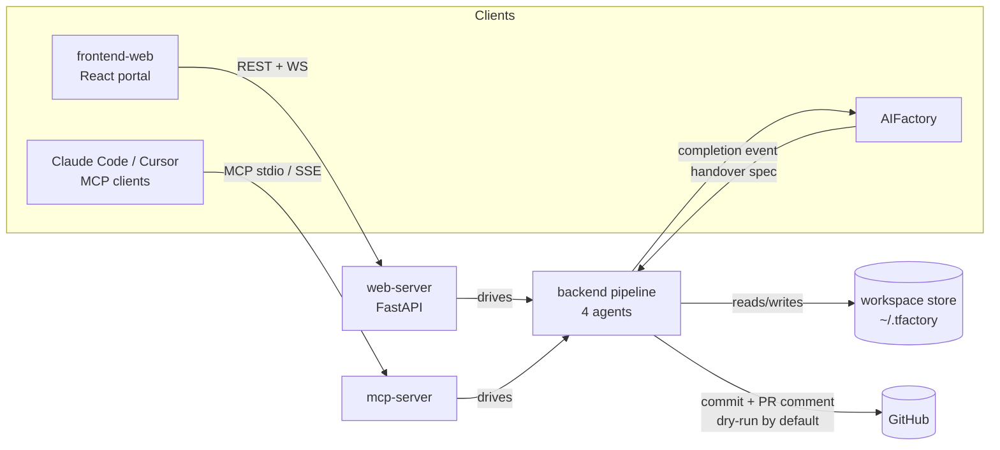

# Architecture overview

TFactory is a **monorepo** with three deployable apps and a shared backend library.

```
apps/
├── backend/        # Python — ALL agent/pipeline logic, CLI, providers, memory
│   ├── core/       # SDK client, auth, security
│   ├── agents/     # The 4 agents + their primitives
│   ├── providers/  # Multi-LLM provider abstraction
│   ├── mcp_server/ # Stdio MCP control plane
│   └── integrations/ graphiti, github, linear, bmad
├── web-server/     # FastAPI REST + WebSocket + MCP proxies
└── frontend-web/   # React 19 + TypeScript + Vite portal
```

## Components and how they relate



- **`tfactory-web-server`** provides the **Web REST API** and the **MCP** HTTP/SSE +
  stdio proxies; it orchestrates pipeline runs and streams progress to the portal
  over WebSocket.
- **`tfactory-frontend-web`** consumes the Web REST API; it is a pure browser client.
- **`tfactory-backend`** is the pipeline itself. It reads/writes the **workspace
  store** and, on terminal status, emits the **completion-event** envelope.
- **`tfactory-mcp-server`** is the stdio control plane that lets external agents
  create/inspect/re-run tasks without touching HTTP.

## The pipeline (the 4 agents)

```
Planner ─► Gen-Functional ─► Executor ─► Evaluator ─► Triager
```

Each agent lives under `apps/backend/agents/`. Every stage's success path calls
`schedule_<next>(spec_dir, project_dir)` to **auto-fire** the next stage
asynchronously, gated by env flags (`TFACTORY_AUTO_PLAN`, `TFACTORY_AUTO_GENERATE`,
`TFACTORY_AUTO_EVALUATE`, `TFACTORY_AUTO_TRIAGE`). Default ON in production; tests
pin OFF. See [The 4-agent pipeline](pipeline.md).

The **Executor** is the only stage with no LLM — it is `tools/runners/docker_runner.py`
running pytest/Jest/Playwright in a `--network=none --read-only` container.

## Modality lanes (v0.2 spine)

The Planner tags every subtask with a **lane**: `unit` · `browser` · `api` ·
`integration` · `mutation`, mapped to a language + framework (pytest · Jest ·
Playwright, with TypeScript mutation via Stryker). The Evaluator dispatches
mutation by `subtask.language`.

## Out of scope (by design)

- **Application security scanning** (SAST/DAST of the code under test) — delegated
  to dedicated pipelines, not generated here.
- **Automatic pushes** — all Git/PR side-effects are **dry-run by default**.

A separate, read-only **cloud posture (CSPM)** flow (epic #133) assesses AWS/GCP/Azure
accounts (access → discovery → topology → Prowler/CIS scan → verdict →
remediation). That is cloud *posture*, distinct from app-code SAST/DAST.

## Key cross-cutting facts

- **Never call `anthropic.Anthropic()` directly** — route Claude through
  `core.client.create_client()` and other providers through
  `providers.factory.get_provider()`. See [LLM providers](../providers.md).
- **SDK seams** (`_resolve_*_client`, `_invoke_session`, `runner_fn`) are mockable;
  the test suite never hits a real LLM or Docker daemon.
- **Memory** is Graphiti over an embedded LadybugDB (no Docker required).
