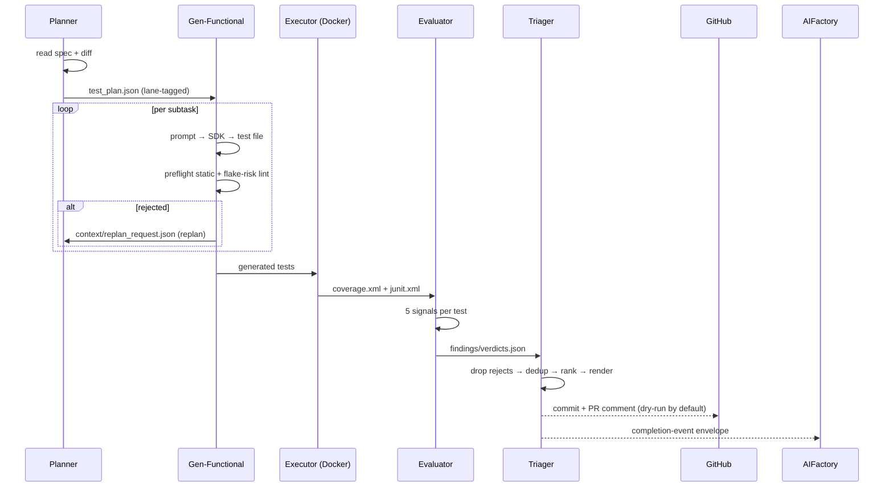

# The 4-agent pipeline

```
  Planner ─► Gen-Functional ─► Executor ─► Evaluator ─► Triager
```

Each agent has its own system prompt (`prompts/<agent>.md`) and an assembly helper
in `prompts_pkg/prompts.py` that prepends a per-call CONTEXT block. The Triager has
no LLM prompt — it is a pure-compute orchestrator.



## Planner — `agents/planner.py`

- **Reads:** `context/aifactory_spec.md` + `context/diff.patch` (and `test_plan.json`
  on replan).
- **Writes:** `test_plan.json` — lane-tagged subtasks across the v0.2 spine, one
  phase per acceptance criterion.
- **Modes:** initial + replan. `replan_count >= 2` → status `stuck`.
- **Limits:** hard cap 30 subtasks; soft warning at 15.
- Each subtask carries `(language, framework, lane, target_name, intent)`; the plan
  is validated against the framework registry.

## Gen-Functional — `agents/gen_functional.py`

- **Per-subtask loop:** prompt → SDK → write test file.
- **Two guardrails per subtask:**
  - `preflight_static.py` — subprocess-checks every import resolves.
  - `flake_risk_lint.py` — AST scan for 5 flake patterns (dict/set iter-order,
    random-without-seed = **high/reject**; `time.sleep`,
    `datetime.now`-without-freeze = **medium/flag**).
- **Rejection** → writes `context/replan_request.json` → triggers a Planner replan.
- **Status:** `generating → generated / generated_empty / replan_needed /
  gen_functional_failed`.

## Executor — `tools/runners/docker_runner.py` (no LLM)

- `DockerRunner.run_pytest` in a `--network=none --read-only` container.
- Emits `coverage.xml` + `junit.xml` to a scratch volume.
- The Evaluator's `runner_fn` seam wraps this; tests pass canned exit codes.

## Evaluator — `agents/evaluator.py`

Structurally separate from Gen-Functional (research-mandated: a generator must not
self-validate). Builds an `EvaluatorSignals` bundle per completed test from
**five signals** (four pre-computed in code, one LLM-judged):

| # | Signal | Primitive | Output |
|---|--------|-----------|--------|
| 1 | coverage delta | `coverage_delta.py` (Cobertura parser + set math) | lines gained |
| 2 | stability | `stability_runner.py` (3× re-run via `runner_fn`) | stable / flaky |
| 3 | mutation | `mutate_probe.py` (AST mutates ONE assertion) | KILLED / SURVIVED |
| 4 | lint promotion | `lint_promotion.py` (promotes flake-lint mediums) | promoted flags |
| 5 | semantic relevance | the LLM, via `evaluator.md` | high / medium / low |

- Mutation is routed per-language by `mutation_dispatch.py` (Python `mutate_probe`
  vs TypeScript Stryker; Java/PIT future).
- `flaky_history.py` persists each test's pass/fail across runs
  (`<workspace>/<project>/test_history.json`) so chronically flaky tests are
  flagged even when one run's 3× stability happens to pass.
- **Writes:** `findings/verdicts.json`; validates `test_id` presence + verdict ∈
  `{accept, reject, flag}`.

## Triager — `agents/triager.py`

- Loads `verdicts.json`; wraps as `TriageCandidate`s.
- Drops rejects; dedups byte-identical + whitespace-normalised via `triage_dedup.py`.
- Ranks by `(verdict_priority, mutation, stability, coverage_delta, test_id)`.
- Renders `findings/triage_report.{md,json}` via `triage_report.py`.
- **Side-effects (DRY-RUN by default):**
  - `tools/git_writer.py` — commit to the feature branch (`TFACTORY_TRIAGER_GIT_WRITE=1`).
  - `tools/pr_comment.py` — `gh pr comment` (`TFACTORY_TRIAGER_PR_COMMENT=1`).
- **Final status:** `triaged / triaged_empty / triager_failed`.

On terminal status the Triager fires the opt-in
[completion-event envelope](../apis/completion-event.md) and prepares the
AIFactory handback artifact (`findings/handback_request.{md,json}`).

## Auto-fire chain

Every stage's success path calls `schedule_<next>(spec_dir, project_dir)` to fire
the next stage asynchronously, gated by env:
`TFACTORY_AUTO_PLAN` · `TFACTORY_AUTO_GENERATE` · `TFACTORY_AUTO_EVALUATE` ·
`TFACTORY_AUTO_TRIAGE`. Default ON in production; tests pin OFF.

## Bidirectional AIFactory ↔ TFactory bridge (epic #182)

When a run finishes with failing tests, TFactory packages a **correction**
(`agents/handback/`) and hands it back to AIFactory, whose receiver writes
`QA_FIX_REQUEST.md` onto the original spec and runs the QA Fixer. The operator
sends it via `/handback-to-aifactory`; `/tfactory-fixloop` drives a bounded
test→fix→re-test loop capped by `TFACTORY_HANDBACK_MAX_CYCLES` (default 2 → `stuck`).
